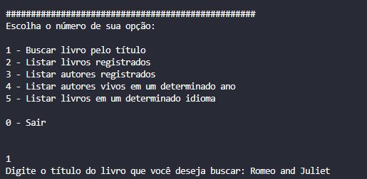
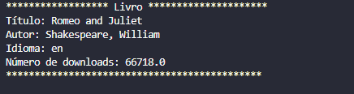
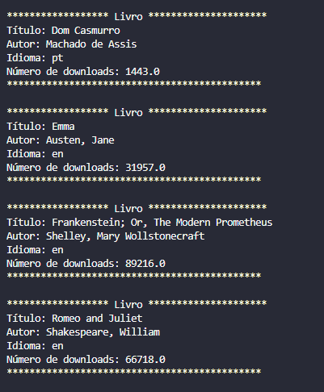
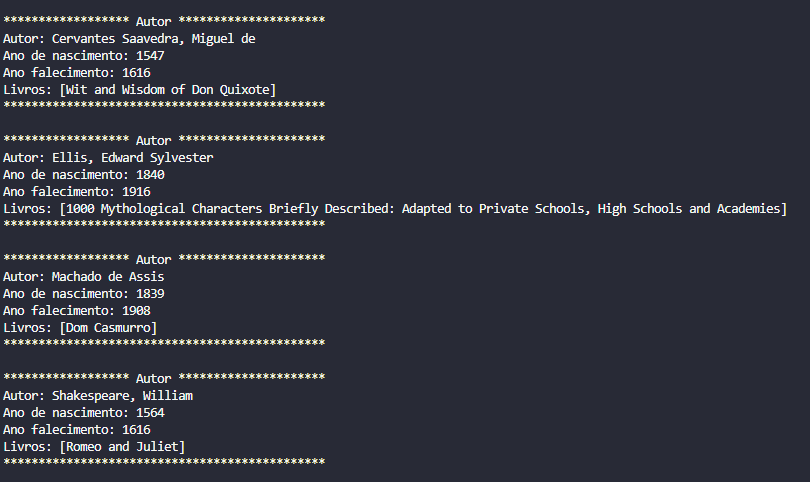
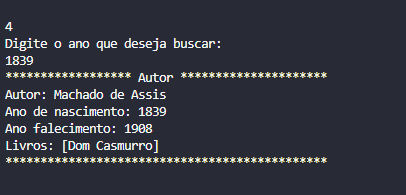
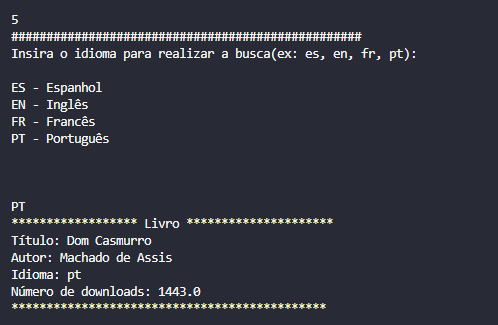

# 📚 LiterAlura: Catálogo de Livros com Spring Boot


Este projeto foi desenvolvido como parte do desafio **PRATICANDO SPRING BOOT – CHALLENGE LITERALURA**, com o objetivo de construir um catálogo de livros interativo via terminal, utilizando Java 17, Spring Boot, PostgreSQL e a API Gutendex.

---

## 🧠 Desafio

O desafio propõe a criação de uma aplicação Java com Spring Boot que permita ao usuário interagir via terminal para buscar, listar e filtrar livros e autores. Os dados são obtidos da API Gutendex e armazenados localmente em um banco relacional, promovendo o aprendizado prático em:

- Consumo da [API Gutendex](https://gutendex.com/) para buscar informações de livros.
- Persistência de dados com Spring Data JPA.
- Criação de entidades e relacionamento entre tabelas.
- Interação com o usuário por meio de menus e opções no console.
- Implementar filtros e consultas personalizadas sobre os dados persistidos.

---


## 🛠️ Tecnologias Utilizadas

- **Java 17+**
- **Spring Boot 3+**
- **Spring Data JPA**
- **PostgreSQL**
- **API Gutendex (https://gutendex.com/)**
- **Jackson (para parse de JSON)**
- **Maven**

---

## 🌐 Sobre a API Gutendex

A **Gutendex API** é uma API REST gratuita que fornece acesso a mais de 70.000 livros do Projeto Gutenberg.

### 🔍 Exemplo de requisição:


---

## ✅ Funcionalidades da Aplicação

1. **Buscar Livro pelo Título**  
   O usuário pode inserir o nome de um livro para buscá-lo na API Gutendex. Caso encontrado, o livro será salvo no banco de dados.

2. **Listar Livros Registrados**  
   Exibe todos os livros salvos no banco de dados, com título, idioma e autor.

3. **Listar Autores**  
   Mostra todos os autores registrados, incluindo os livros associados a cada um.

4. **Listar Autores Vivos em um Determinado Ano**  
   Permite buscar autores que estavam vivos em um ano informado pelo usuário.

5. **Listar Livros por Idioma**  
   Exibe os livros filtrando por idioma (pt, en, es, fr).

---

## 🚀 Como a Aplicação Funciona (Passo a Passo)

### 1. Inicialização
- Ao rodar a aplicação, um menu interativo é exibido no terminal com as opções disponíveis:



- Buscar Livro pelo Título
O usuário insere o opção desejada, neste caso, opção 1. 
Em seguida digitar o nome de um livro, a aplicação faz uma requisição para a API Gutendex, caso o livro seja encontrado, seus dados são salvos no banco de dados. Se o livro não for encontrado, será exibido uma mensagem "Livro não encontrado. Tente outro título.", mas se o livro já estiver salvo no banco de dados, a seguinte mensagem será mostrada "Livro já consta no banco de dados."



 - Listar Livros Registrados
Consulta o banco de dados e exibe todos os livros cadastrados com suas informações principais.



- Listar Autores Registrados
Mostra todos os autores únicos e exibe os livros associados a cada autor.



- Buscar Autores Vivos em um Ano
O usuário informa um ano (ex: 1839). A aplicação retorna todos os autores que estavam vivos nesse ano.



- Listar Livros por Idioma
O usuário escolhe um idioma (ex: pt). A aplicação filtra os livros registrados nesse idioma. 



- Sair da aplicação
Mostra um "Até logo..." ao usuário, assim encerrando a aplicação.


---

## 💡 Melhorias futuras
- Top 10 livros mais baixados.

- Buscar autor pelo nome.

- Consultas com ordenações e paginações.

- Estatísticas de idiomas, autores mais populares, etc.

---

## 🏁 Conclusão
Este projeto oferece uma experiência prática completa com Java, Spring Boot, consumo de APIs REST, persistência com JPA e interação com banco de dados PostgreSQL. Ideal para quem busca consolidar conhecimentos em desenvolvimento backend moderno.

Sinta-se à vontade para contribuir, reportar problemas ou sugerir melhorias!

---

## 📂 Como Executar
1. Clone o repositório do projeto:
   ```bash
   git clone https://github.com/NayaraCalixto/LiterAlura

## 👨‍🏫 Instrutores
- Jacqueline Oliveira
- Iasmin Araújo

---

## 🚀 Projeto do Curso Java One
Este projeto faz parte do desafio proposto no curso <strong>Java One</strong>, com o objetivo de consolidar os aprendizados iniciais em Java através da criação de um sistema prático e funcional.

